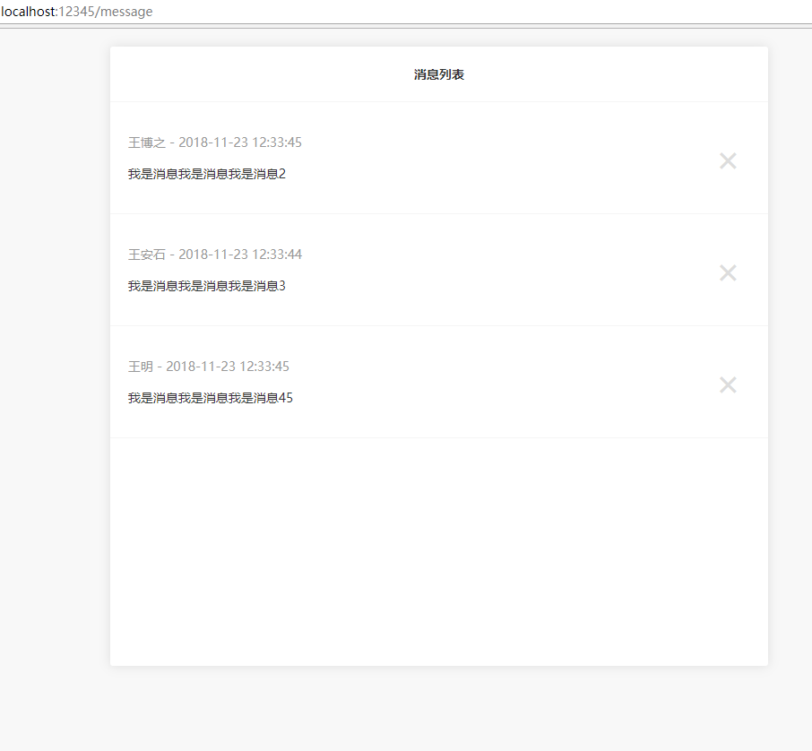
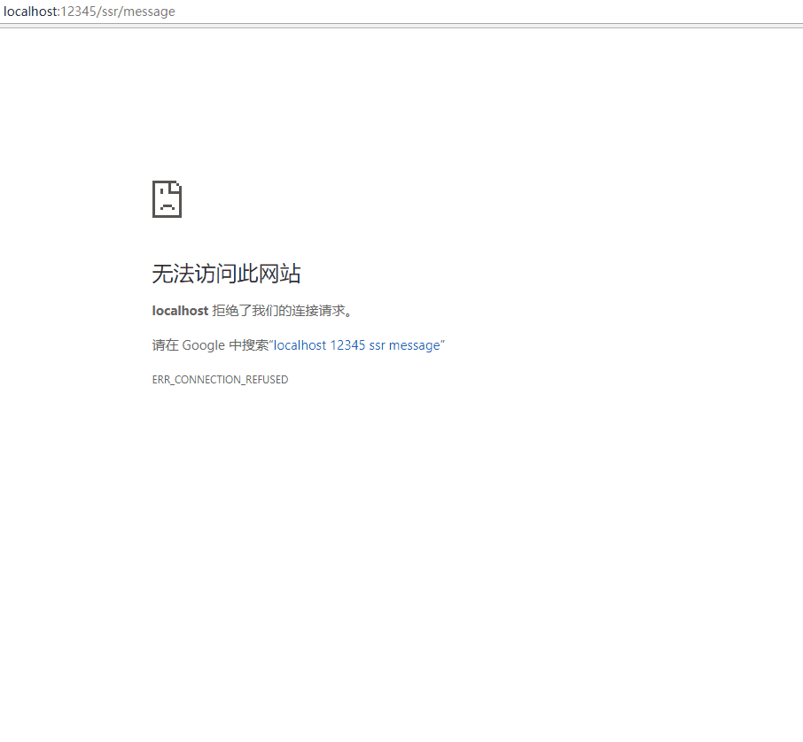
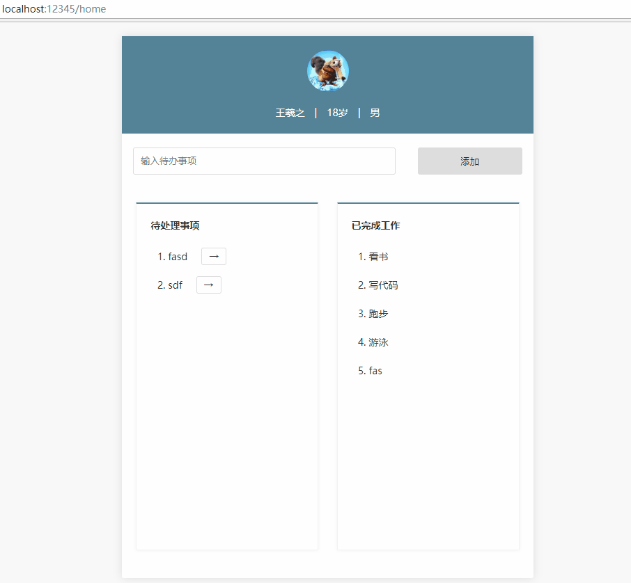
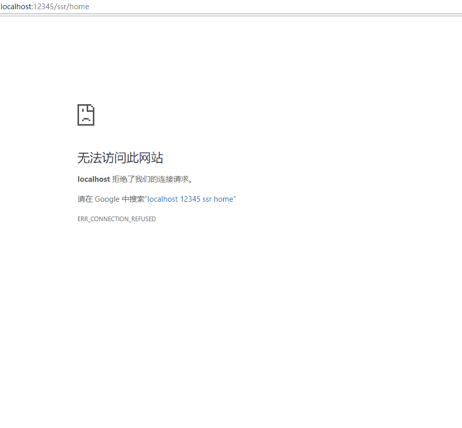

## React-Redux-SSR
在 [React](https://reactjs.org/) 及 [Redux](https://redux.js.org/) 项目中进行服务端渲染（SSR: Server Side Rendering）

[redux-saga](https://github.com/redux-saga/redux-saga) 处理异步action，使用 [express](https://github.com/expressjs/express) 处理页面渲染

[webpack](https://webpack.js.org/) 监听编译文件，[nodemon](https://github.com/remy/nodemon) 监听服务器文件变动

本项目包含四个页面
- [http://localhost:12345/message](http://localhost:12345/message)  React
- [http://localhost:12345/ssr/message](http://localhost:12345/ssr/message)  React + SSR
- [http://localhost:12345/home](http://localhost:12345/home)  React + Redux
- [http://localhost:12345/ssr/home](http://localhost:12345/ssr/home)  React + Redux + SSR

## 解析说明

[解析说明](https://www.cnblogs.com/imwtr/p/9576546.html)

## 使用
1. `cd react-redux-ssr` 进入项目
2. `npm i` 安装依赖
3. `npm run build` webpack编译文件; unix系统使用  npm run build:unix
4. `npm run server` 启动Node服务; unix系统使用  npm run server:unix
5. 访问上述四个页面

## DEMO

